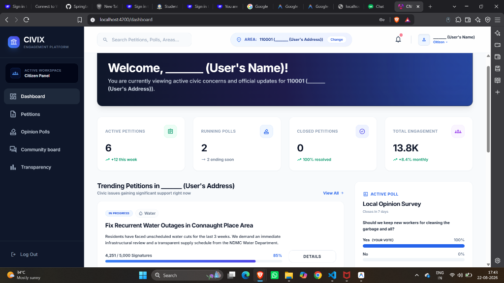
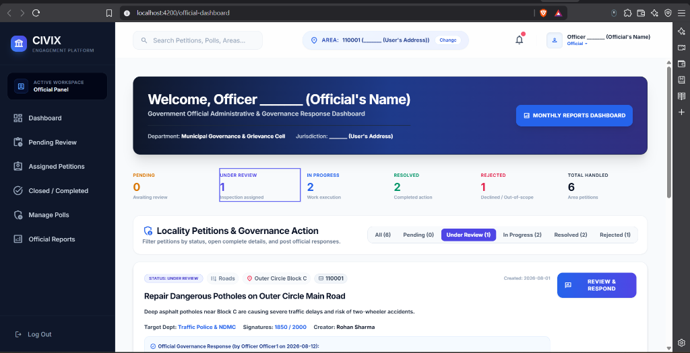
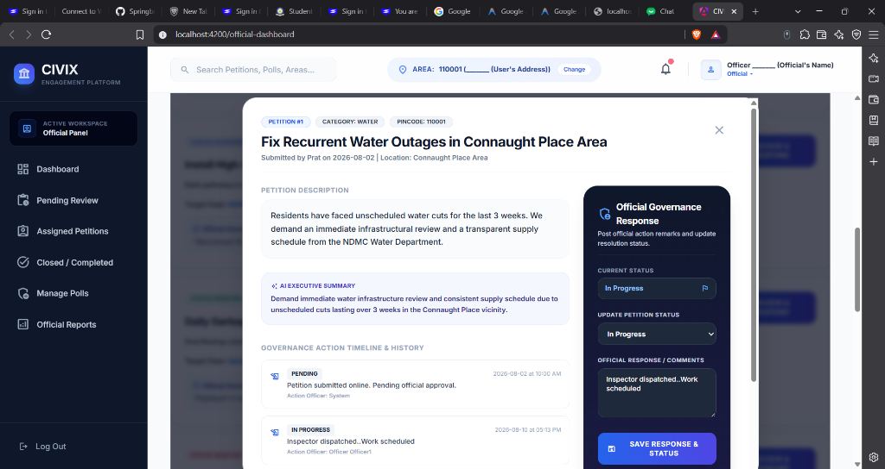
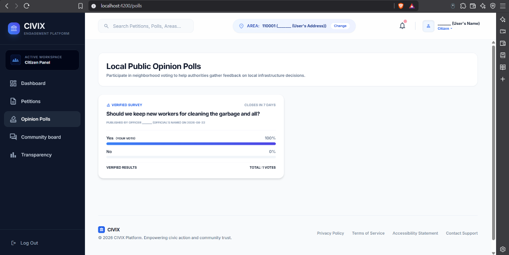
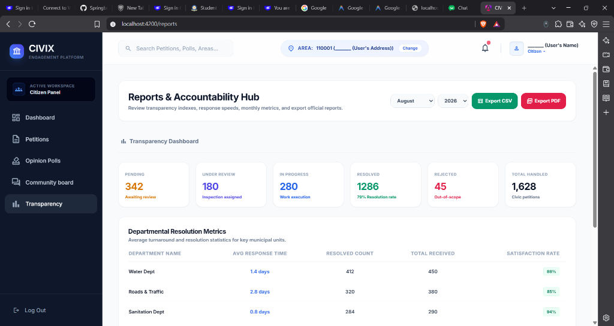

# 🏛️ CIVIX — Smart Digital Civic Engagement & Petition Platform

<p align="center">
  
  
  
  
</p>

---

## 🫥 1. Project Introduction

**CIVIX** is a next-generation Digital Civic Engagement and Petition Platform designed to strengthen communication between citizens and municipal government authorities through technology. The platform empowers citizens to report local civic issues, create and support petitions, participate in public opinion polls, receive emergency announcements, and track municipal actions with complete transparency.

Built as a high-fidelity frontend application, CIVIX features premium design aesthetics, dynamic animations, multi-step identity verification, responsive layouts, and role-based workflows tailored for **Citizens**, **Government Officials**, and **Administrators**.

---

## 📝 2. Project Overview and Features

### 🎬 Key Capabilities

* **Logo Reveal Splash Screen**: Interactive curtain mask reveal, line drawing, and glowing dot stamp on launch.
* **Consolidated Landing Page**: Hero section highlighting platform capabilities, problem comparisons, and active user roles.
* **Split-Screen Authentication & Multi-Step Verification Wizard**: Aadhaar/PAN identity verification simulation with regional location scoping.
* **Citizen Cockpit Dashboard**: Scoped petitions, signature progress bars, community updates, and active public opinion polls.
* **Officials Administrative Dashboard**: Status filter tabs (`Pending`, `Under Review`, `In Progress`, `Resolved`, `Rejected`), petition review cards, and governance response panels.
* **Reports & Transparency Hub**: Departmental turnaround statistics, Month/Year selectors, 6 KPI cards, and one-click **Export CSV** & **Export PDF** functionality.

---

### 📸 Screenshots & UI Showcase

Below are real application screenshots captured directly from the live development server:

| Feature Section | Interface Screenshot |
| :--- | :--- |
| **🧑 Citizen Cockpit Dashboard** |  |
| **👮 Officials Administrative Dashboard** |  |
| **📝 Official Governance Response Panel** |  |
| **📊 Public Opinion Polls & Sentiment** |  |
| **📈 Reports Hub & Export (CSV / PDF)** |  |

---

## ⛏️ 3. Tech Stack, APIs, and Other Resources

| Layer | Technology / Resource | Purpose |
| :--- | :--- | :--- |
| **Frontend Framework** | Angular (v17+) | Standalone components, lazy loaded routing, reactive signals & RxJS. |
| **Styling & Design Token** | Tailwind CSS | Custom color palettes, dark modes, glassmorphism, responsive grids. |
| **State & Role Management** | RxJS Observables | Sharing global role context, area pincode scoping, and session state. |
| **Typography & Icons** | Google Fonts & Material Symbols | Modern typography (Inter, Outfit) and Google UI icons. |
| **Reporting & Exporting** | Native HTML5 & Web Blob API | One-click Export to CSV and printable PDF generation. |

---

## 🧑‍💻 4. Getting Started: Setup and Running Instructions

Follow these instructions to run the application locally on your machine.

### Prerequisites
Make sure you have **Node.js** (v18+) and **npm** installed.

### 1. Clone & Navigate to Project Directory
```bash
git clone https://github.com/ameda-rohith/Civix.git
cd Civix
```

### 2. Install Dependencies
```bash
npm install
```

### 3. Start Development Server
```bash
npm start
```

### 4. Open in Browser
Open your browser and navigate to:
👉 **`http://localhost:4200`**

---

## 🤝 5. How to Contribute and Report Issues

We welcome community contributions! Follow these steps:

1. **Fork the Repository** on GitHub.
2. **Create a Feature Branch**:
   ```bash
   git checkout -b feature/your-feature-name
   ```
3. **Commit your changes**:
   ```bash
   git commit -m "Add new civic feature"
   ```
4. **Push to GitHub & Open a Pull Request**:
   ```bash
   git push origin feature/your-feature-name
   ```
5. **Reporting Issues**: Please submit bugs, feedback, or feature requests via GitHub Issues.

---

## 🔥 6. Conclusion and License

CIVIX bridges the gap between public municipal authorities and local communities, promoting civic accountability, rapid grievance resolution, and transparent governance.

This project is open-source and licensed under the **[MIT License](LICENSE)**
